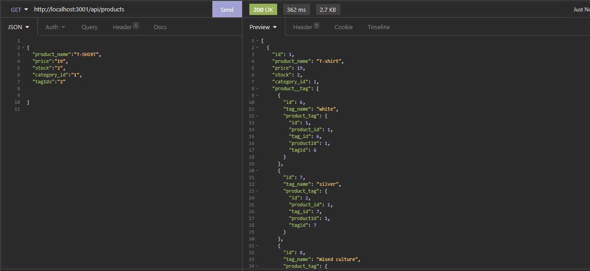

# ORM_E-Commerce_Back_End

## Table of contents
* [General info](#general-info)
* [Technologies](#technologies)
* [Working Application](#working-application)
* [Project Status](#project-status)
* [Room for Improvement](#room-for-improvement)
* [Installation](#installation)
* [License](#license)
* [Contact Me](#contact-me)

## General info

The application allows to manage the back-end of an e-commerce company. Using sequelize models, it allows to display, remove and update existing products, categories and tags but also to create new ones.
## Technologies

Project is created with:
* Node.js
* Express.js
* MySQL

## Working Application

The following image shows the web application's appearance:

## Project Status

* Working

## Room for Improvement

Room for improvement:
* Some changes required when creating or updating a product
* Category model's delete route crashes with some values we pass as id

## Installation

To run locally the application clone [this link](https://github.com/Nico749/ORM_E-Commerce_Back_End.git) on your local machine

## License

Distributed under MIT License.

## Contact me 

Created by [Nico Pasqualini](https://nico749.github.io/Personal-portfolio-/) - feel free to contact me!